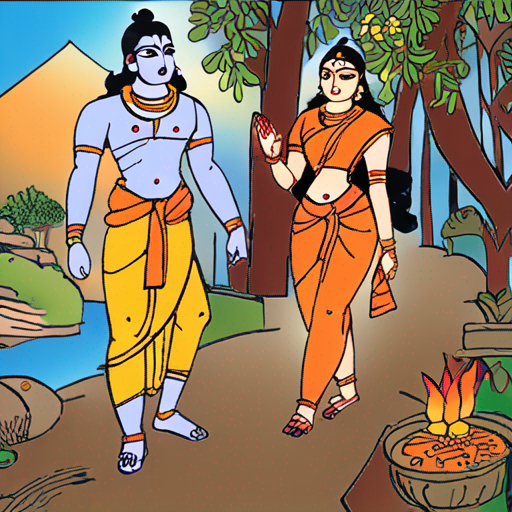
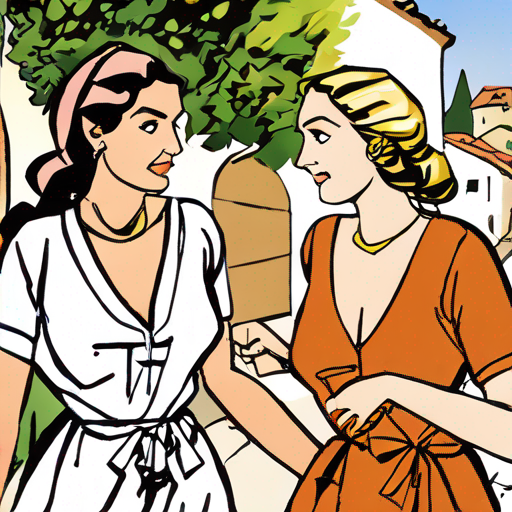
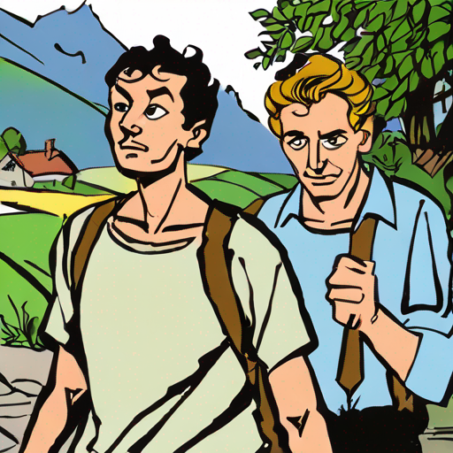
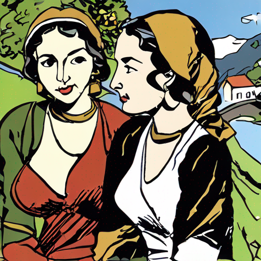
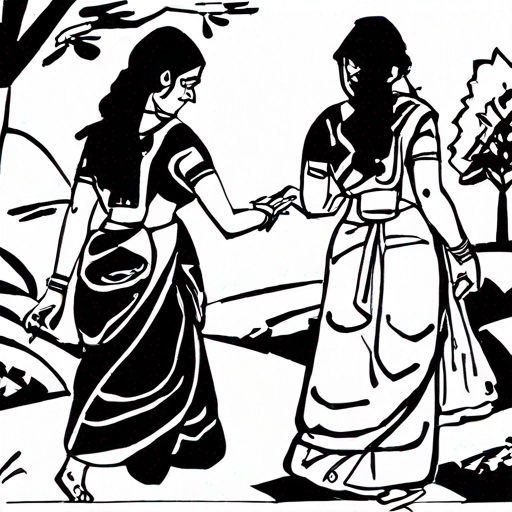
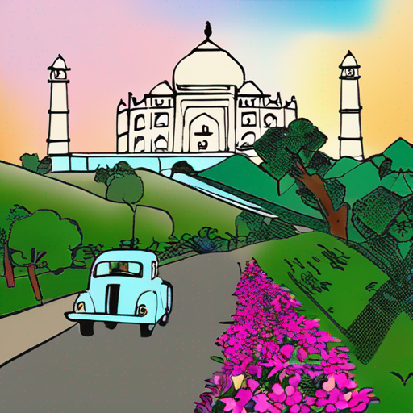
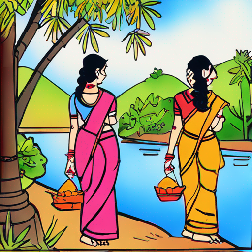

# Bapubomma AI

A LoRA fine tuned version of SDXL trained on Bapu's art work.

## About

I tried to create some images in Bapus art style, more commonly know as Bapubomma, from all the open source image gen models that are available for free users but it seems like they did not include his work in any of the training dataset. 

So here we are with a LoRA fine tuned version of SDXL trained on Bapu's work. In a way, this is a tribute to Bapu garu and his work which will now last for generations to come with models like this.

Sathiraju Lakshminarayana (15 December 1933 – 31 August 2014) know as Bapu(బాపు), is a famous artist/illustrator from India whos work is very popular among Telugu and Tamil speaking population in India and elsewhere. He is mostly known for his work in the Telugu film industry and his books and paintings are very popular among the Telugu people, especially kids from 80s/90s.

**BapuBomma** is a word play on Bapu and Bomma(Doll) which usually means a beautiful girl/woman in Telugu.

## Data source

All the images are from [bapuartcollection](https://bapuartcollection.com/) and are used for educational purposes only.

## Example predictions

  

    
        
bapubomma, Lord Rama and Sita walking together in a beautiful south Indian village near Godavari river, clear faces

  

  

    
        
bapubomma, two sisters walking together in a beautiful south French village, beautiful village, river, clear faces

  

  

      
        
bapubomma, two brothers walking together in a beautiful south Swiss village, beautiful village, river, clear faces

    

  

    
        
bapubomma, two sisters walking together in a beautiful south Swiss village, beautiful village, river, clear faces

  

  

    
        
bapubomma, two sisters walking together in a beautiful south India village, beautiful village, river, clear faces, no face deformities, perfect human structure, artistic illustrations, monochrome, black and white

  

    

        
        
bapubomma, A car and a bike going towards Taj Mahal on a wide and long road with mountains behind Taj Mahal, no street lights, 1940s style, lush trees and beautiful flowers

    

  

    
        
bapubomma, two sisters walking together in a beautiful south India village, beautiful village, river, clear faces, artistic illustrations

  

## How to use the model?

The repo contains a [zip file ](replicate/trained_models/lora_trained_model_bapubomma_v1.tar) of the latest model, v1, which contains a **embeddings.pti** file and a **lora.safetensors** file. These files can be used to generate images in Bapus style.

You can also soon generate images using the model directly on [Replicate.com](https://replicate.com/vkolagotla/bapubomma_ai/versions/572fa33614e484e0d9f7707707d5e1f04f00c968b733c8609647d9a2d9a523ff) where the model is hosted(private for now).

## Future work

The main objective of this repo is to 1. Create a model that can generate images in Bapus style and 2. Learn more about LoRA as this is my first attempt at fine tuning an image model. So i will try to create a pipeline to automate the process of training and find a way to monitor training process and to find the best models with current data by tweaking the training parameters.

This is pretty much an initial train run just see how the model performs. I will try to add more images in the future and train further.

There was no proper scientific evaluation of the model as for now and the model was just retrained based on visual inspection of the predictions. I will try to learn more about it and add it to the repo for future trainings.

## License/Credits

This is purely a personal project and is not intended for commercial use as the train data has a strict non-commercial license. All the images are from the [source](https://bapuartcollection.com/) and are used for educational purposes only.
