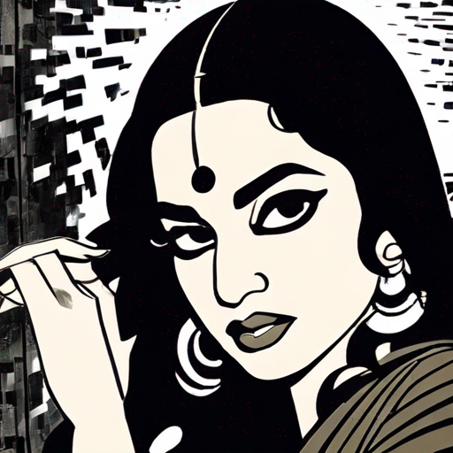
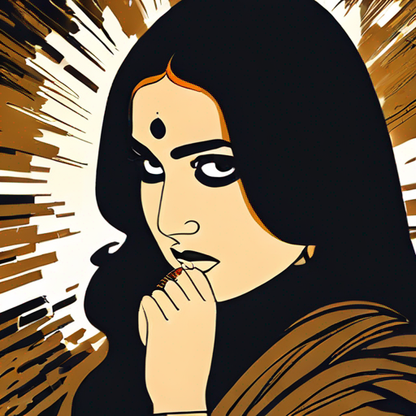
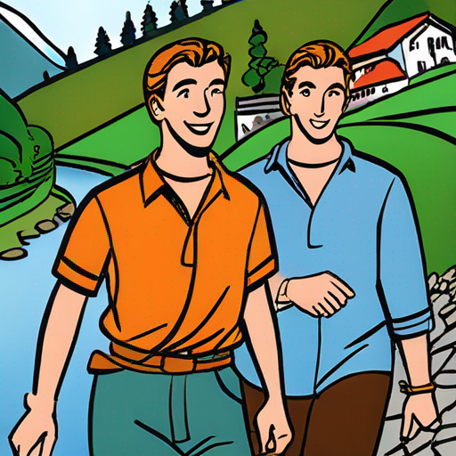
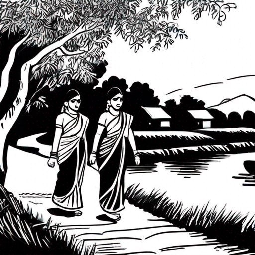
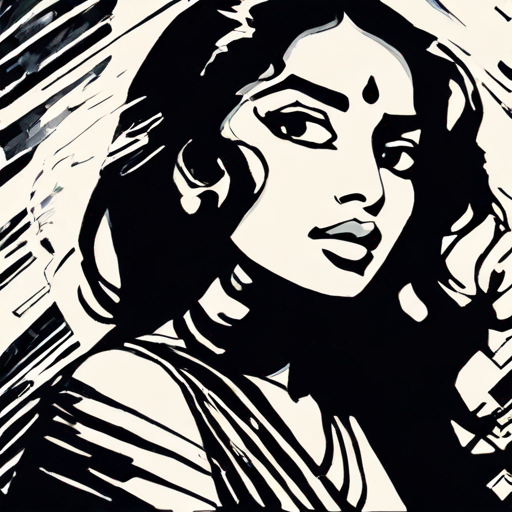
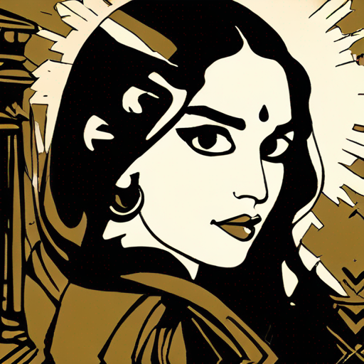
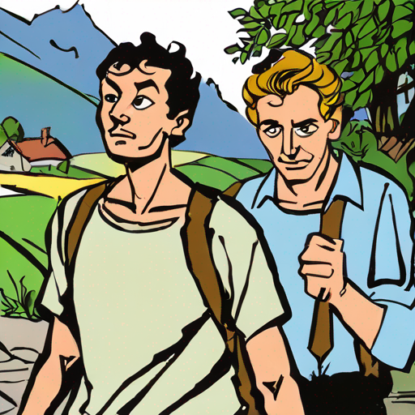
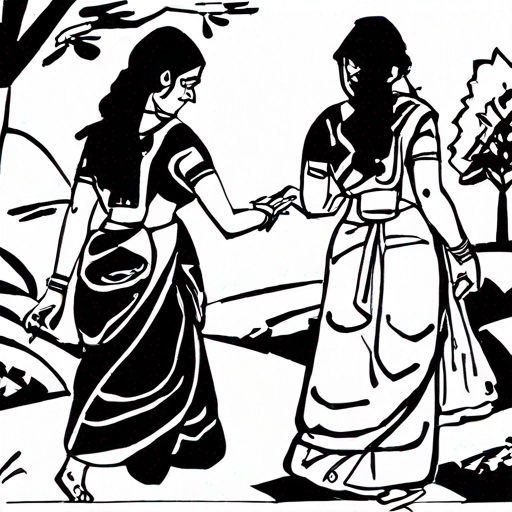

# Bapubomma AI

A LoRA fine tuned version of SDXL trained on Bapu's art work.

## About

I tried to create some images in Bapu art style, more commonly know as `Bapubomma`, from all the open source image gen models that are available for free users but it seems like they did not include his work in any of the training dataset. 

So here we are with a LoRA fine tuned version of SDXL trained on Bapu's work. In a way, this is a tribute to Bapu garu and his work which will now last for generations to come with models like this.

Sathiraju Lakshminarayana (15 December 1933 – 31 August 2014) know as Bapu(బాపు), is a famous artist/illustrator from India whos work is very popular among Telugu and Tamil speaking population in India and elsewhere. He is mostly known for his work in the Telugu film industry and his books and paintings are very popular among the Telugu people, especially kids from 80s/90s.

**BapuBomma** is a word play on Bapu and Bomma(Doll) which usually means a beautiful girl/woman in Telugu.

## Data source

All the images are from [bapuartcollection](https://bapuartcollection.com/) and are used for personal and non-commercial purposes only.

## Example predictions

### Bapubomma AI v1.5

<table>
  <tr>
    <td></td>
    <td></td>
    <td></td>
    <td></td>
  </tr>
  <tr>
    <td align="center">bapubomma, artistic illustration, a Create a black and white art of a Young indian woman surrounded by dark duotone vertical textures glitch image, dramatic and bold contrasts. Incorporate a hint of sepia for a vintage feel</td>
    <td align="center">bapubomma, artistic illustration, Create art of a Young indian woman surrounded by dark duotone vertical textures glitch image, dramatic and bold contrasts. Incorporate a hint of sepia for a vintage feel</td>
    <td align="center">bapubomma, two brothers walking together in a beautiful south swiss village, beautiful village, river, clear faces</td>
    <td align="center">bapubomma, two sisters walking together in a beautiful south india village, beautiful village, river, clear faces, artistic illustrations</td>
  </tr>
</table>

### Bapubomma AI v1

<table>
  <tr>
    <td></td>
    <td></td>
    <td></td>
    <td></td>
  </tr>
  <tr>
    <td align="center">bapubomma, Lord Rama and Sita walking together in a beautiful south Indian village near Godavari river, clear faces</td>
    <td align="center">bapubomma, two sisters walking together in a beautiful south French village, beautiful village, river, clear faces</td>
    <td align="center">bapubomma, two brothers walking together in a beautiful south Swiss village, beautiful village, river, clear faces</td>
    <td align="center">bapubomma, two sisters walking together in a beautiful south India village, beautiful village, river, clear faces, no face deformities, perfect human structure, artistic illustrations, monochrome, black and white</td>
  </tr>
</table>

## How to use the model?

The git repo contains a zip file in `replicate/trained_models/` for the latest model(v1.5), which contains a **embeddings.pti** file and a **lora.safetensors** file. These files can be used to generate images in Bapus style.

You can also soon generate images using the model directly on [Replicate.com](https://replicate.com/vkolagotla/bapubomma_ai/versions/b6f5a122638ad602aad03838b2f186222f3e47e8edd282ba8332e7ee653e3e1a) where the model is hosted. You need to signin with github to use the model.

## Future work

The main objective of this repo is to **1.** Create a model that can generate images in Bapus style and **2.** Learn more about LoRA as this is my first attempt at fine tuning an image model. So i will try to create a pipeline to automate the process of training and find a way to monitor training process and to find the best models with current data by tweaking the training parameters.

There was no proper scientific evaluation of the model as for now and the model was just retrained based on visual inspection of the predictions. As of now i could not find a way to monitor the training loss via Weights and Biases and can only see the number of steps in the replicate website.

More data might help the training process, so i will try to find more images from Bapus work from other sources.

## Change log
### v1.5

* Updated the dataset with upscaled versions of the images from v1.0 and removed some images that did not look good after the upscaling.
* Used Playground AI to upscale the images by 4x.(they offer free 30 upscales per month)
* Dataset now has 40 images in a zip file with size of 102.1MB.
* Same training parameters as v1.0 with lr=4e-4 and resolution=512x512

## License/Credits

This is purely a personal project and is not intended for commercial use as the train data has a strict non-commercial license. All the images are from the [source](https://bapuartcollection.com/) and can only be used for personal and non-commercial purposes.
